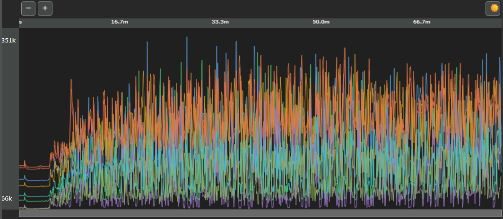

# RawGraph — Raw Fluorescence Viewer

Example of using the RawGraph canvas library to visualize raw fluorescence data from a DNA sequencing instrument.

**[Live demo](https://pkvspb.github.io/rawgraph-public/examples/vanilla/index.html)**

- Up to **8 channels**, each rendered as a colored trace on an HTML5 Canvas
- **Zoom in/out** — ×2 per click, window centered on the visible range
- **Horizontal scroll bar** — drag to pan after zooming in
- **X-axis** in seconds/minutes, tick spacing adapts automatically to zoom level
- **Y-axis** auto-scaled to the visible window on every draw
- **Light and dark theme** support via CSS custom properties

<!--  -->


## Demos

Two equivalent demos are included — a build-free vanilla JS/HTML/CSS version
and a Vite + React version.

### Vanilla demo (no build step)

ES modules require a local server (browsers block `file://` imports).

```bash
npx http-server -p 8080 -c-1
```

Then open `http://localhost:8080/examples/vanilla/` in a browser.

VS Code: start the server, then **F5** → **Vanilla demo**.

### React demo

```bash
cd examples/react
npm install
npm run dev
```

Then open the URL Vite prints (defaults to `http://localhost:5173/`), or with
the dev server running, VS Code: **F5** → **React demo**. See
[React wrapper pattern](#react-wrapper-pattern) below for how the library is
integrated as a component.

## Files

| File | Purpose |
|------|---------|
| `examples/vanilla/index.html` | Page structure — all required element IDs |
| `examples/vanilla/example.css` | Layout and theming — adjust the `--*` constants at the top to resize the component |
| `examples/vanilla/example.js` | Theme detection and `initRawComponent` call |
| `examples/react/` | React demo — see [React wrapper pattern](#react-wrapper-pattern) below |
| `api/mockRawValues.js` | Real fluorescence data: 19 202 pts × 8 channels, 250 ms/sample |
| `lib/rawcomponent.js` | Library entry point — **import this file** |
| `lib/rawgraph.js` | Canvas renderer (also exported for standalone use) |
| `lib/rawscroll.js` | Scroll bar (also exported for standalone use) |

## DOM contract

`initRawComponent` locates elements by ID at call time. The following elements must exist in the page before the script runs:

| ID | Tag | Purpose |
|----|-----|---------|
| `rawgraph-id` | `<canvas>` | Main graph — library paints channels here |
| `rawgraph-container-id` | `<div>` | Controls graph canvas size via `getBoundingClientRect()` |
| `rawscroll-id` | `<canvas>` | Horizontal scroll bar |
| `rawscroll-container-id` | `<div>` | Controls scroll canvas size |
| `rawzoom-out-id` | `<button>` | Zoom out (halves the zoom level) |
| `rawzoom-in-id` | `<button>` | Zoom in (doubles the zoom level) |
| `raw-x-axis-id` | `<canvas>` | X-axis time labels |
| `raw-x-axis-container-id` | `<div>` | Controls X-axis canvas width |
| `raw-y-axis-max-id` | `<span>` | Y-axis maximum label (positioned by the library) |
| `raw-y-axis-min-id` | `<span>` | Y-axis minimum label (positioned by the library) |

**Size the `<div>` containers with CSS, not the `<canvas>` elements directly.** The library reads container dimensions and resizes the canvases automatically, including on window resize.

## Providing your own data

```js
const values = {
    channels: [
        [/* channel 1 — Array<number> */],
        [/* channel 2 */],
        // … up to 8 channels
    ],
    timeStepMs: 250,   // milliseconds between consecutive samples
};
```

Channels may have different lengths; the longest determines the total time axis. Values are raw integers — the Y-axis scales automatically to the visible range.

## `initRawComponent` reference

```js
const cleanup = initRawComponent(graph, scroll, zoom, values, colors, xAxis, yAxis);
```

| Parameter | Shape | Description |
|-----------|-------|-------------|
| `graph` | `{ rawGraphId, rawGraphContainerId }` | Canvas and container IDs for the main graph |
| `scroll` | `{ rawScrollId, rawScrollContainerId, rawScrollBackground, rawScrollPortColor }` | Scroll bar IDs and colors |
| `zoom` | `{ rawZoomOutId, rawZoomInId }` | Zoom button IDs |
| `values` | `{ channels, timeStepMs }` | Data arrays and sampling interval |
| `colors` | `string[]` | One CSS color per channel |
| `xAxis` | `{ rawXAxisId, rawXAxisContainerId, rawXAxisFontSize, rawXAxisFontName, rawXAxisFontColor }` | X-axis canvas and font settings |
| `yAxis` | `{ rawYAxisMinId, rawYAxisMaxId, rawYAxisFontSize, rawYAxisFontColor, rawYAxisFontName }` | Y-axis label elements and font settings |

`cleanup()` removes all event listeners attached by the library (resize, click, pointer). Call it when tearing down the component.

## React wrapper pattern

`examples/react/` is a small Vite + React app showing how to wrap the library
as a component instead of calling `initRawComponent` directly from a script.

Key file: `examples/react/src/RawGraphComponent.jsx`. The pattern:

- A `useRef` on the graph's container `<div>`, and a `useEffect` keyed on
  `[values, theme]` that calls `initRawComponent(...)` and returns its cleanup
  function — React calls the cleanup automatically before the next effect run
  and on unmount.
- All chart colors (the 8-channel `colors` array, axis font color, scroll bar
  colors) are read from CSS custom properties via `getComputedStyle` rather
  than hardcoded in JS — see the `--raw-channel-1` … `--raw-channel-8`,
  `--text`, `--scroll-back` and `--scroll-port` variables in
  `examples/react/src/App.css`. Toggling `data-applied-mode` on `<html>` and
  re-running the effect (via the `theme` dependency) is enough to re-theme
  the chart.
- The component renders the same fixed-ID containers/canvases as
  `examples/vanilla/index.html`'s component portion; the surrounding "demo
  chrome" (resizable left panel, zoom buttons, theme toggle) lives in
  `examples/react/src/App.jsx`.

This is the recommended approach when integrating RawGraph into a
component-based app.

## About the library files

The files in `lib/` are pre-built, obfuscated distributions of the RawGraph
library, vendored into this repository and updated periodically from
upstream. `api/mockRawValues.js` provides the mock fluorescence data used by
both demos. See [License](#license) for usage terms.

## License

This repository uses two licenses:

- **`lib/`** — the compiled, obfuscated `rawcomponent.js`/`rawgraph.js`/
  `rawscroll.js` are proprietary and provided under the terms in
  [`lib/LICENSE`](lib/LICENSE): you may use them unmodified as a dependency in
  your own projects, but may not redistribute, modify, decompile, or resell
  them.
- **Everything else** (examples, mock data, documentation) is licensed under
  the Apache License, Version 2.0 — see [`LICENSE`](LICENSE).
